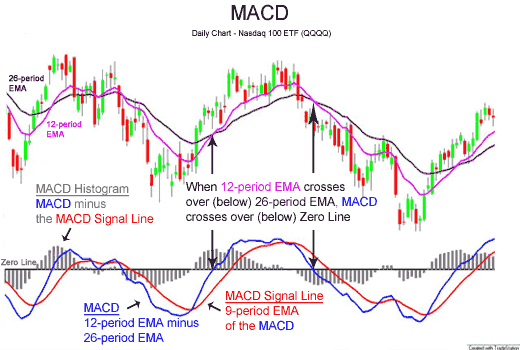

```{r setup, include=FALSE}
knitr::opts_chunk$set(echo = TRUE)
library(Quandl)
library(lubridate)
library(timetk)
library(plotly)
library(ggcorrplot)
library(tidyverse)
library(tidyquant)
library(data.table)
library(tidymodels)
library(modeltime)
library(prophet)
library(jsonlite)
library(tsfknn)
library(kknn)
library(TTR)
library(tseries)
```

# 1. Wprowadzenie

W ramach niniejszej analizy prognozujemy ceny ropy Brent przy użyciu różnych metod modelowania szeregów czasowych.

**ARIMA (AutoRegressive Integrated Moving Average)** to klasyczny model statystyczny używany do analizy i prognozowania danych szeregów czasowych.

Model ARIMA łączy trzy komponenty:

-   **AutoRegresję (AR)**: wykorzystanie zależności między aktualną obserwacją a jej przeszłymi wartościami,

-   **Integrację (I)**: stabilizację szeregu czasowego poprzez różnicowanie (usuwanie trendu),

-   **Średnią ruchomą (MA)**: modelowanie błędu prognozy jako kombinacji błędów z przeszłości.

**Prophet** to model opracowany przez Facebooka, zaprojektowany specjalnie z myślą o prognozowaniu danych z wyraźną sezonowością dzienną, tygodniową i roczną. Prophet jest odporny na brakujące dane i nietypowe wartości (outliery) oraz umożliwia uwzględnianie dodatkowych zmiennych wyjaśniających (regresorów) oraz świąt (holidays).


W projekcie wykorzystano m.in. modele Prophet, Prophet z dodatkowymi zmiennymi, ARIMA oraz KNN. Oceniono ich dokładność i przeprowadzono predykcję na przyszłe 30 dni.

------------------------------------------------------------------------

# 2. Pobranie danych

```{r}
brent_prices <- tq_get("BZ=F")
brent_prices %>% plot_time_series(date, close, .smooth = T,
                                  .interactive = T,
                                  .title = "Brent Oil price (USD)")
```

------------------------------------------------------------------------

# 3. Dodanie zmiennych objaśniających

```{r}
dolar_index <- tq_get("DX-Y.NYB")

brent_prices <- brent_prices %>% 
  mutate(date = as.Date(date)) %>%
  left_join(dolar_index %>% mutate(date = as.Date(date)), by = "date") %>%
  select(date, close = close.x, dxy = close.y) %>%
  drop_na()
```

# 4. Stacjonarność szeregu i trend

```{r}
adf.test(brent_prices$close, alternative = "stationary")
```

### Dodanie okresów specjalnych

W celu uwzględnienia wpływu nadzwyczajnych wydarzeń na ceny ropy Brent, do modelu Prophet dodano specjalne okresy obejmujące okres pandemii COVID-19 oraz wybuch wojny w Ukrainie.

```{r}
# Okres pandemii COVID-19 (marzec 2020 - czerwiec 2021)
covid_dates <- tibble(
  holiday = 'covid',
  ds = seq(as.Date("2020-03-01"), as.Date("2021-06-30"), by = "day"),
  lower_window = 0,
  upper_window = 0
)

# Okres wojny w Ukrainie (luty 2022 - grudzień 2022)
war_dates <- tibble(
  holiday = 'war',
  ds = seq(as.Date("2022-02-20"), as.Date("2022-12-31"), by = "day"),
  lower_window = 0,
  upper_window = 0
)

# Połączenie wszystkich wydarzeń w jedną tabelę
holidays_df <- bind_rows(covid_dates, war_dates)
```

Uwagi:

-   Święta zostały przekazane do modelu przez argument holidays w set_engine().

-   Parametr prior_scale_holidays = 20 zwiększa wpływ świąt na wynik modelu.

-   Aktualna implementacja Prophet w tidymodels może nie w pełni wspierać wszystkie funkcjonalności holidays. Oceniono w innym skrypcie i okazało się że holidays pogarszają wyniki.

# 5. Inżynieria cech: analiza techniczna




```{r}
brent_prices <- brent_prices %>%
  arrange(date) %>%
  mutate(
    macd_full = MACD(close, nFast = 12, nSlow = 26, nSig = 9, maType = EMA),
    macd = macd_full[, "macd"],
    signal = macd_full[, "signal"],
    sma_14 = SMA(close, n = 14),
    macd_hist = macd - signal
  ) %>%
  mutate(
    bb = BBands(close, n = 20, sd = 2),
    bb_up = bb[, "up"],
    bb_dn = bb[, "dn"],
    bb_mavg = bb[, "mavg"],
    bb_pctb  = (close - bb_dn) / (bb_up - bb_dn)
  ) %>%
  select(-macd_full, -bb) %>%
  drop_na()
```

------------------------------------------------------------------------

# 6. Podział na dane treningowe i testowe

```{r}
splits <- brent_prices %>% time_series_split(assess = "1 month", cumulative = TRUE)
splits %>% tk_time_series_cv_plan() %>% plot_time_series_cv_plan(date, close)
```

------------------------------------------------------------------------

# 7. Modelowanie

```{r}
model_prophet <- prophet_reg(mode = "regression", growth = "linear", season = "additive") %>%
  set_engine("prophet", weekly.seasonality = TRUE) %>%
  fit(close ~ date, training(splits))

model_prophet_with_holidays <- prophet_reg(mode = "regression", growth = "linear", season = "additive", prior_scale_holidays = 20) %>%
  set_engine("prophet", weekly.seasonality = TRUE, holidays = holidays_df) %>%
  fit(close ~ date, training(splits))

model_prophet_with_dxy <- prophet_reg(mode = "regression", growth = "linear", season = "additive") %>%
  set_engine("prophet", weekly.seasonality = TRUE) %>%
  fit(close ~ date + dxy, training(splits))

model_prophet_with_MACD <- prophet_reg(mode = "regression", growth = "linear", season = "additive") %>%
  set_engine("prophet", weekly.seasonality = TRUE) %>%
  fit(close ~ date + dxy + macd_hist, training(splits))

model_prophet_with_SMA14 <- prophet_reg(mode = "regression", growth = "linear", season = "additive") %>%
  set_engine("prophet", weekly.seasonality = TRUE) %>%
  fit(close ~ date + dxy + sma_14, training(splits))

model_prophet_with_MACD_SMA <- prophet_reg(mode = "regression", growth = "linear", season = "additive") %>%
  set_engine("prophet", weekly.seasonality = TRUE) %>%
  fit(close ~ date + dxy + macd_hist + sma_14, training(splits))

model_prophet_with_bb <- prophet_reg(mode = "regression", growth = "linear", season = "additive") %>%
  set_engine("prophet", weekly.seasonality = TRUE) %>%
  fit(close ~ date + dxy + macd_hist + sma_14 + bb_pctb, training(splits))

model_arima <- arima_reg(mode = "regression", seasonal_period = 12) %>%
  set_engine("auto_arima", stepwise = FALSE, approximation = FALSE) %>%
  fit(close ~ date, training(splits))

model_knn <- nearest_neighbor(mode = "regression", neighbors = 5) %>%
  set_engine("kknn") %>%
  fit(close ~ date, training(splits))

# Budowa modelu Prophet z uwzględnieniem holidays

```

------------------------------------------------------------------------

# 8. Symulacja przyszłych wartości zmiennych

```{r}
simulate_regressor_prophet <- function(data, future_dates, reg_name, periods = NULL) {
  if (is.null(periods)) { periods <- nrow(future_dates) }
  reg_data <- data %>% select(ds = date, y = !!sym(reg_name)) %>% drop_na()
  model <- prophet(reg_data, daily.seasonality = TRUE)
  future <- make_future_dataframe(model, periods = periods)
  forecast <- predict(model, future)
  forecast_tail <- tail(forecast$yhat, periods)
  return(forecast_tail)
}

future_dates <- tibble(date = seq.Date(from = max(brent_prices$date) + 1, by = "day", length.out = 30))

simulated_dxy <- simulate_regressor_prophet(brent_prices, future_dates, "dxy")
simulated_macd <- simulate_regressor_prophet(brent_prices, future_dates, "macd_hist")
simulated_sma14 <- simulate_regressor_prophet(brent_prices, future_dates, "sma_14")
simulated_bb_pctb <- simulate_regressor_prophet(brent_prices, future_dates, "bb_pctb")

future_data <- future_dates %>%
  mutate(dxy = simulated_dxy, macd_hist = simulated_macd, sma_14 = simulated_sma14,bb_pctb = simulated_bb_pctb)
```

------------------------------------------------------------------------

# 9. Kalibracja i porównanie modeli

```{r}
models_table <- modeltime_table(
  model_prophet,
  model_arima,
  model_prophet_with_holidays,
  model_prophet_with_dxy,
  model_prophet_with_MACD,
  model_prophet_with_SMA14,
  model_prophet_with_MACD_SMA,
  model_prophet_with_bb,
  model_knn
)

models_table <- update_model_description(models_table, 3, "Prophet + Holidays")
models_table <- update_model_description(models_table, 4, "Prophet + DXY")
models_table <- update_model_description(models_table, 5, "Prophet + DXY + MACD")
models_table <- update_model_description(models_table, 6, "Prophet + DXY + SMA14")
models_table <- update_model_description(models_table, 7, "P. + DXY + MACD + SMA14")
models_table <- update_model_description(models_table, 8, "P. + DXY + MACD + SMA14 + BB")

calibration_table <- models_table %>%
  modeltime_calibrate(testing(splits))

calibration_table %>%
  modeltime_accuracy() %>%
  table_modeltime_accuracy()


library(kableExtra)


acc_table <- calibration_table %>%
  modeltime_accuracy()

# Ładna tabelka z wyśrodkowanym tytułem i widocznymi liniami
acc_table %>%
  knitr::kable(
    digits = 3,
    caption = "<center><strong>Podsumowanie wyników modeli - Miary dokładności</strong></center>",
    format = "html"
  ) %>%
  kable_styling(
    full_width = FALSE,
    position = "center",
    font_size = 14,
    bootstrap_options = c("striped", "hover"),
    fixed_thead = TRUE  # Wyrównanie nagłówka
  ) %>%
  row_spec(0, bold = TRUE, background = "#f2f2f2") %>%
  row_spec(1:nrow(acc_table), extra_css = "border-bottom: 2px solid black;") %>%
  column_spec(1:ncol(acc_table), extra_css = "border-right: 1px solid black; border-left: 1px solid black;") %>%
  column_spec(1, width = "1in")  # Wyrównanie szerokości pierwszej kolumny


```

## Wyjaśnienie metryk

Oceny wydajności predykcyjnej zastosowanych modeli dokonano w oparciu o następujące metryki:

-   **Średni Błąd Bezwzględny (MAE)**: Mierzy średnią wartość bezwzględnych różnic między rzeczywistymi a prognozowanymi wartościami.

    Wzór: $$
    MAE = \frac{1}{n} \sum_{t=1}^{n} |y_t - \hat{y}_t|
    $$

-   **Średni Procentowy Błąd Bezwzględny (MAPE)**: Oblicza średnią procentową różnicę między rzeczywistymi a prognozowanymi wartościami.

    Wzór: $$
    MAPE = \frac{1}{n} \sum_{t=1}^{n} \left| \frac{y_t - \hat{y}_t}{y_t} \right| \times 100
    $$

-   **Skalowany Średni Błąd Bezwzględny (MASE)**: Skaluje błąd w stosunku do błędu naiwnego modelu.

    Wzór: $$
    MASE = \frac{MAE}{\frac{1}{n-1} \sum_{t=2}^{n} |y_t - y_{t-1}|}
    $$

-   **Symetryczny Średni Procentowy Błąd Bezwzględny (SMAPE)**: Jest to wersja MAPE, która uwzględnia symetrię w obliczaniu błędów.

    Wzór: $$
    SMAPE = \frac{1}{n} \sum_{t=1}^{n} \frac{|y_t - \hat{y}_t|}{\frac{|y_t| + |\hat{y}_t|}{2}} \times 100
    $$

-   **Pierwiastek Średniego Błędu Kwadratowego (RMSE)**: Mierzy rozrzut błędów prognozy, biorąc pod uwagę kwadraty różnic.

    Wzór: $$
    RMSE = \sqrt{\frac{1}{n} \sum_{t=1}^{n} (y_t - \hat{y}_t)^2}
    $$

-   **Współczynnik Determinacji (R²)**: Mierzy, jak dobrze model wyjaśnia zmienność danych.

    Wzór: $$
    R^2 = 1 - \frac{\sum_{t=1}^{n} (y_t - \hat{y}_t)^2}{\sum_{t=1}^{n} (y_t - \bar{y})^2}
    $$

# 10. Prognoza

## Testowy forecast

```{r}
calibration_table %>%
  modeltime_forecast(new_data = testing(splits), actual_data = brent_prices) %>%
  plot_modeltime_forecast(.interactive = TRUE, .legend_max_width = 25) 
```

## Finalny forecast

```{r}
calibration_table %>%
  modeltime_refit(brent_prices) %>%
  modeltime_forecast(new_data = future_data, actual_data = brent_prices) %>%
  plot_modeltime_forecast(.interactive = TRUE, .plotly_slider = TRUE)
```

------------------------------------------------------------------------

# 11. Podsumowanie

-   Najlepsze wyniki uzyskano dla modeli Prophet z dodatkowymi zmiennymi technicznymi.
-   Modele ARIMA i KNN miały wyższą wartość błędu.
-   Dodanie zmiennych makroekonomicznych (Dollar Index) i technicznych (MACD, SMA, Bollinger Bands) zwiększyło trafność prognoz.

------------------------------------------------------------------------

# 12. Dalsze kroki

-   Przetestować więcej zmiennych makroekonomicznych.
-   Zastosować Regresory, które wcześniej dają sygnał o zmianie trendu i cofnąć dane o czas prognozy, tak aby nie musieć tworzyć prognozy regresorów (lub np. Leading Indicators)
-   Rozszerzyć analizę o dłuższe horyzonty czasowe lub krótsze horyzonty i uzyskiwać sygnały KUP/SPRZEDAJ
-   Zastosować inne algorytmy np. KNN z normalizacją danych i dedykowany do szeregów czasowych

------------------------------------------------------------------------
